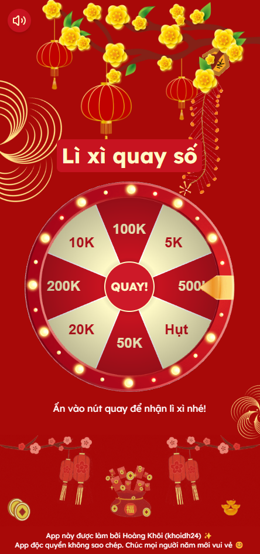

> English below

# VÒNG QUAY MAY MẮN - CHÚC TẾT

  

Tôi muốn troll tất cả mấy đứa nhóc trong họ hàng hoặc là bạn bè tôi với 1 cái vòng quay may mắn - trúng ô nào lì xì ô đó.

---

## Tại sao tôi lại làm cái này? 

Năm 2025, vào lúc đêm giao thừa, tôi đã nghĩ ra cái ý tưởng này chỉ để troll mọi người vì bạn bè dev xung quanh tôi thường hay nói vui là:

> Ước gì làm cái vòng quay cho mấy đứa nhỏ, trúng nhiêu lì xì bấy nhiêu, nhưng mà phải trúng số nhỏ nhỏ hoặc tỉ lệ hụt nhiều lên.

Nhằm thỏa mãn "Satan" trong lòng tôi và các thằng đồng nghiệp dev của tôi, tôi đã viết ra cái app này để mọi người có thể vào phá phách, chọc cười bạn bè hay lũ nhỏ trong gia đình vì tỉ lệ hụt siêu cao, và tỉ lệ trúng tiền mệnh giá cao nó còn nhỏ nhoi hơn cơ hội tôi trúng tuyển vào FAANG (quá buồn vì tôi quá gà) 🐔

---

Mọi người có thể vào cái website có đính sẵn ở trên cái repository này hoặc **[click vào đây](https://chuc-tet.vercel.app)** để có cơ hội chơi cái này. Nó đủ vui để có thể câu dẫn con nít chơi cả ngày à nha 🦉

---

## Tái bút:

cái file `README.md` này tôi chỉnh sửa vào ngày 21/01/2026, nên là nếu bạn nghĩ năm nay tôi bỏ xóa cái repo này thì...**NẰM MƠ ĐI!** 🦥

---

# LUCKY WHEEL - HAPPY LUNAR NEW YEAR!

  

I wanna bamboozle whole kids from my family or my friends with this one - the lucky wheel - what they see what they get.

---

## Why I've done this?

In the past year, on the New Year Eve, I blew up my mind with this idea that I can troll everybody because my all-around devs are always telling me:

> Damn! I wish I could have a lucky wheel for my kids - envelope for what they see and what they get, but we need to have some adjustment about the rating.

To satisfy the "my my Satan" and that of my fellow, I created this app so everyone can mess around, prank friends or kids at home because the failure rate is super high, and the chance of winning high-denomination currency is even smaller than my chance of getting accepted into FAANG (so sad because I'm so bad at it) 🐔

---

So, everyone can access this via attached link on the repository or **[click here](https://chuc-tet.vercel.app)** to play this. This is fun for kids, they will got addicted (trust me) 🦉

---

## P/s:

I modify this `README.md` file on 21/01/2026, so...If you think this repo will be f*cked up forever...**KEEP DREAMING!** 🦥
